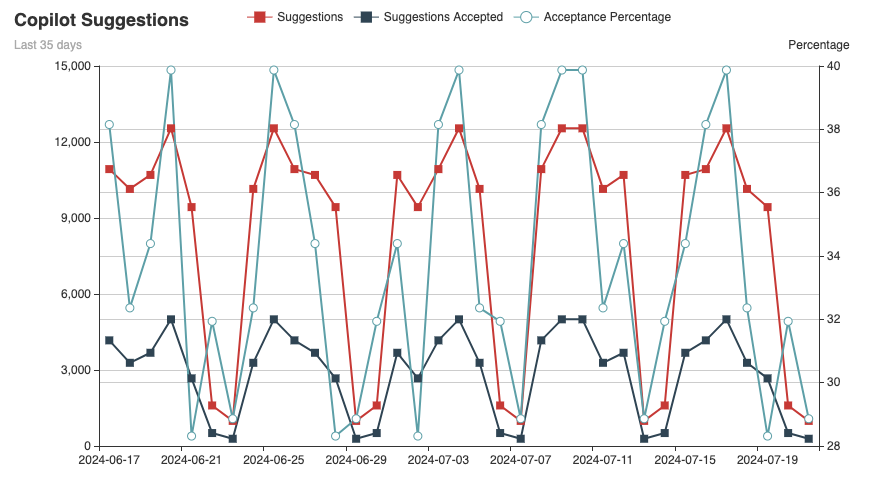

# Copilot Metrics
Fetch and analyze an enterprise's GitHub Copilot usage metrics, using the GitHub API ([endpoint details](https://docs.github.com/en/rest/copilot/copilot-usage?apiVersion=2022-11-28)).

# Pre-requisites
## GitHub Permissions
To pull the data from GitHub, your account needs to have the **Enterprise Billing Manager** role. With the correct role assigned, generate a [bearer token](https://docs.github.com/en/authentication/keeping-your-account-and-data-secure/managing-your-personal-access-tokens#about-personal-access-tokens) with the appropriate permissions to start using the GitHub API. The following cURL command will validate your token works with the relevant GitHub endpoint:

```bash
curl -L \
 -H "Accept: application/vnd.github+json" \
 -H "Authorization: Bearer <token>" \
 -H "X-GitHub-Api-Version: 2022-11-28" \
 https://api.github.com/enterprises/<your-enterprise-name>/copilot/usage
 ```

Without GitHub access (either due to permissions or internet access), the program can rely solely on stored data if the GitHub access functionality is disabled in ``main.go``.

## Environment variables
This program relies on two environment variables:
- ``METRICS_ENTERPRISE``. This variable contains your GitHub Enterprise's name. This is the name from your URL path used in the test curl command above.
- ``METRICS_TOKEN``. This variable contains the bearer token generated by GitHub.

# Usage
## Running
To build the project and run it as an executable:
```bash
go build
./copilot-metrics
```

To run the application straight from source 
```bash
go run main.go
```
## Outputs
The retrieved data is written to a JSON file - ``copilot-metrics-<year>-<month>-<date>.json`` - and the corresponding charts are published into an HTML report file - ``copilot-metrics-report-<year>-<month>-<date>.html``. 

See the example ``copilot-metrics-report-example.html`` in the repo.

## Example charts
The following charts generated with the included mock data.



